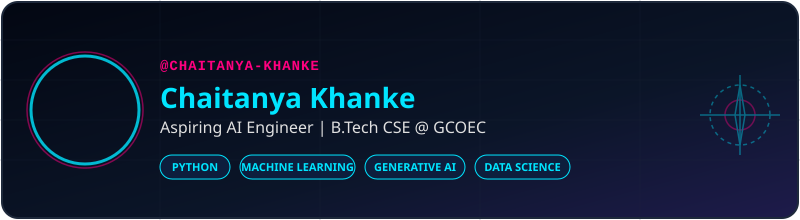

# CHAITANYA KHANKE

  

  
  

---

### 💫 About Me
Hi! I'm **Chaitanya Khanke**, a Computer Science Engineering student at the **Government College of Engineering, Chandrapur (GCOEC)**. I am highly passionate about Artificial Intelligence, Machine Learning, and Data Science. I love automating tasks, writing clean Python scripts, and building real-world software solutions.

- 🎓 **Education:** B.Tech in Computer Science Engineering (Gondwana University, 2024 - 2028)
- 🧠 **Focus Areas:** Generative AI, LLMs, Machine Learning, Data Analytics, and Data Structures.
- 🚀 **Career Goal:** Aspiring AI / Machine Learning Engineer.

---

### 🛡️ Professional Certifications

  
  
   
  
  

---

### 🏆 Hackathons & Achievements
- 🚀 **Prompt Wars Virtual (Hack2skill & Google for Developers):** Built **EcoSphere** (FastAPI, Python, JS, CSS) to track carbon footprints and offset simulations.
- 📊 **Kaggle Competitions:** Actively participate in Machine Learning and Data Science challenges.
- 🛡️ **Oracle & Copado Credentials:** Earned professional certifications in Generative AI, Data Science, and DevOps AI.

---

### 🛠️ Tech Stack & Skills

  <!-- Languages -->
  
  
  
  
   
  <!-- Frameworks & Tools -->
  
  
  
  
   
  <!-- Domain Skills -->
  
  
  
  

---

### 📊 GitHub Stats & Streaks

  
  

---

  

 

  <picture>
    <source media="(prefers-color-scheme: dark)" srcset="https://raw.githubusercontent.com/CHAITANYA-KHANKE/CHAITANYA-KHANKE/output/github-contribution-grid-snake-dark.svg">
    <source media="(prefers-color-scheme: light)" srcset="https://raw.githubusercontent.com/CHAITANYA-KHANKE/CHAITANYA-KHANKE/output/github-contribution-grid-snake.svg">
    
  </picture>

